# The Vision of the metadata module
## Metadata metamodel
Metamodel describes the internal structure of the metadata module to store information about service-level structure of any other module required to describe.
Let's take UML-metamodel as a foundation with a lot of simplifications.

Start with the minimal static structure to support lists (at least, for the beginning).

### Static structure
Depictured below diagrams describe the metadata metamodel from different sides
#### Model class
---
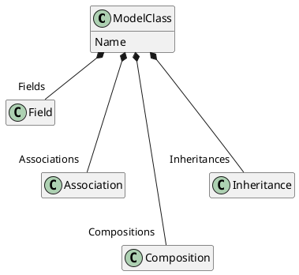
**Example:**
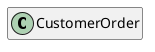
#### Field
---
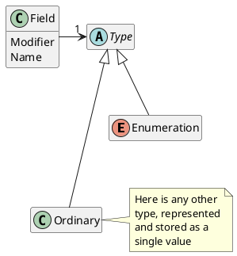
**Example:**

Fields of the class CustomerOrder:
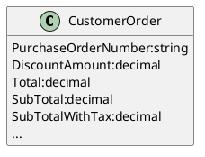
#### Relations
---
Relations have 3 different types: association, composition, inheritance.
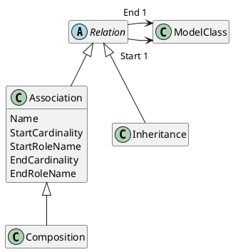
**Association**

Association is just a reference to another model class.
Only "\*->0..1" or "\*->1" cardinality supported. Cardinality "0..1" just means *optional* or *nullable*.

**Association example:**
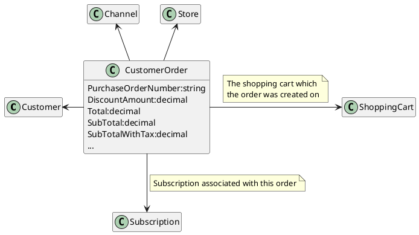

**Composition**

The composition requires that a part instance be included in at most one composite at a time and that the composite object has sole responsibility for the disposition of its parts. The cardinality of the aggregate end may not exceed one.

**Composition example:**
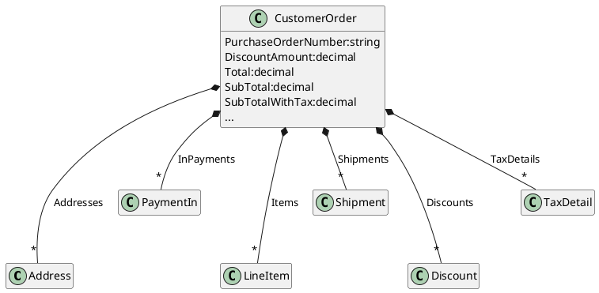
**Inheritance**

Inheritance means each of the descendants will include attributes and participation in associations of the ancestors.

**Inheritance example:**
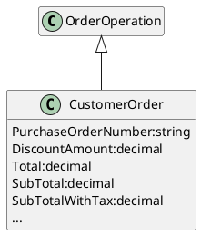

#### Projections (user groups (???))
---
Each of the implementation classes can have one or more specific projections.
Specific class's projection is a predefined (and named) set of:
1. Fields of the owner class
2. Fields from the associated classes at any level from the side with cardinality 1, 0..1
3. Projections for composed classes.

Projections can be used for many purposes, for example:
1. Limit available fields in the user interface
2. Limit data accessibility for specific users
3. Automated user edit forms definition
4. ...

**Projection metamodel:**
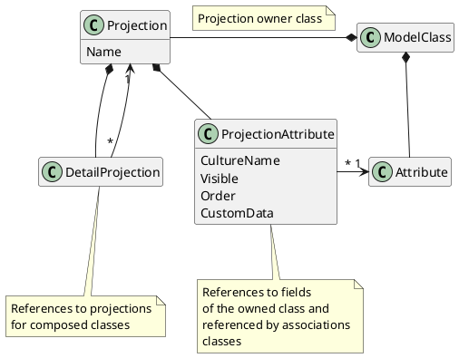
Note: Big theme to later explain/discuss is a way of representing projection types and projection type-specific metadata. For example, if the projection is used for lists we need to store in projection: captions, ordering preferences, etc... If the projection used for edit forms, we need to store additional metadata, related to validation, some control tuning, maybe control placement, etc... 
In the specification above, I've added (for a while) CustomData field to store such specifics.

**Projection example:**

Look at the synthetic example of CustomerOrder structure

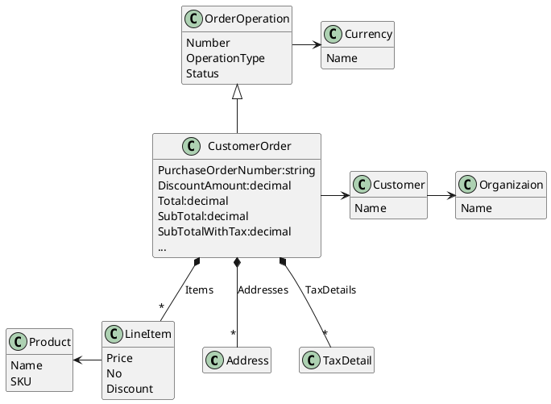
Possible projections example (3 projections) for the example above:

*CustomerOrder.OrdersList*
|Definition|Value|
|-|-|
|Owner class| CustomerOrder|
|Projection name| OrdersList|
|Description| Used to display orders list in the grid|

| Included fields |
|-|

|Field|Name|Description|
|------|---------|---------|
|Customer.Organization.Name<!---->|Organization|Show customer-associated organization name in the list|
|Customer.Name<!---->|Customer|Show customer name in the list|
|Number||As is|
|Status||As is|
|Total||As is|
|Currency.Name<!---->|Currency|Show total's currency in the list|

| Included projections for composed classes|Description|
|-|-|
|*None*|Because it does not matter for lists|

*LineItem.LineItemEdit*
|Definition|Value|
|-|-|
|Owner class| LineItem|
|Projection name| LineItemEdit|
|Description| Used to edit line items in the edit form|

| Included fields |
|-|

|Field|Name|Description|
|------|---------|---------|
|Product|Product|Used to select product from dropdown or lookup control|
|Product.Name<!---->|Product|Product name|
|Product.SKU<!---->|SKU|Stock-keeping unit code|
|No||As is|
|Price||As is|
|Discount||As is|

| Included projections for composed classes|Description|
|-|-|
|*None*|There is no composed classes to LineItem)

*CustomerOrder.OrdersEdit*
|Definition|Value|
|-|-|
|Owner class| CustomerOrder|
|Projection name| OrdersEdit|
|Description| Used to edit orders|

| Included fields |
|-|

|Field|Name|Description|
|------|---------|---------|
|Customer|Customer|Used to select customer from dropdown or lookup control|
|Customer.Organization.Name<!---->|Organization| Show customer's organization for notice|
|Customer.Name<!---->|Customer name| Show customer name|
|Number|| As is|
|Status|| As is|
|Total|| As is|
|Currency||Used to select currency from dropdown control|
|Currency.Name<!---->|Currency name| Show currency name|

| Included projections for composed classes|Description|
|-|-|
|LineItem.LineItemEdit|Used to edit lineitems together with order on an order edit form|

## Module functionality
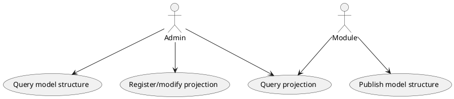
## Metadata management API
Service-level of the metadata module should implement these groups of methods.
### Register the model structure
There should be methods for registering service-level model structure: fields, relations, etc...
### Query for the model structure 
There should be methods for querying previously registered service-level model structure, something like:
1. Get registered classes
1. Get class fields
1. Get associations
1. Get field details: name, type, etc...
1. ...
Useful to construct/edit projections in dynamic (admin user interface).
### Register/modify the projection
There should be methods for registering projections and editing projection-specific metadata. It needs an interface to change some projection details to allow admin to tune the application without programming.
### Query for projections
An external application, or the module, or standard platform component can query the metadata module to interpret somehow, examples:
1. The platform grid component uses the metadata to reorder columns, name columns, apply sort order, some field-type formatting, etc...
2. The platform edit form component uses the metadata to tune control placement, fine-tune complex controls, validation rules, etc...
3. ...

## Metadata discovery utils
It seems we need to automate the extraction of metadata for existing modules. Utility method that gathers existing service-level models from the assemblies and interprets their structure in some default manner:
1. Models as model classes
2. Fields with value types as fields
3. Fields with reference types as associations
4. Enumerables and collections as compositions
5. Discover projection static descriptions
6. ...
## Projection static descriptions
Should have a mechanism do define default projections in source codes. It can be useful to prepare defaults: orderings for lists, caption language-specific names, some specific properties, etc. Then the admin may change such values thru VC-manager to customize lists, forms (for example) just by settings changes.

## Applying projections to the data
There we should discuss/place receipts for specific goals of applying projections:
1. Gather projections metadata for lists/grids
1. Gather projections metadata for edit forms
1. Apply projections to return data while accessing from the client (reduce data transmission volume)
1. Apply projections while preparing indexing document
1. Apply projections when constructing selections while reading data from the storage
1. Apply projection-based permission to reduce the amount of data according to the rights
1. ...

# The future (wide vision, including some dreams)

We should decide, what sort of metadata we should express

## Goals

Metadata management could simplify the automation of development:
* User interfaces / user-specific data availability
* Indexing through knowing entities structure (stop to discover types from the data, declarative definition of the index structure)
* CRUD (No need to read unusable data, then reduce for interprocess transmission)
* Interprocess communications (automated development of APIs, plain integrations, etc...)
* Business-process automation thru interprocess communications (some BUSes, orchestrators, message processors, etc...)

## Aspects
* Static structure (structure of the models/relationships at the service level)
* The behavior of the system (Services, service-level methods, and events/messages)

## Questions, problems
* Metamodel structure definition is the basis of all, should invent simple and the best for us
* How to explain existing modules. How to preserve metadata correctness for existing code/modules

# Ideas
## plainUML
Use plainUML for metadata description because there are a lot of plugins for different tools to render, parse, etc.
## Define module structure standard
In the future, the metadata metamodel can be used to standardize service-level models representation and development (one clear next step to automate).